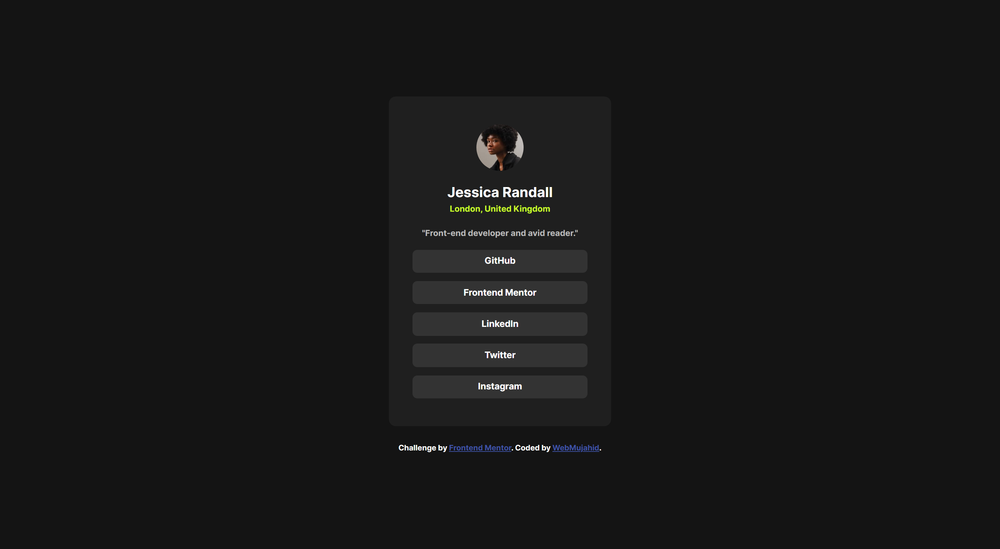
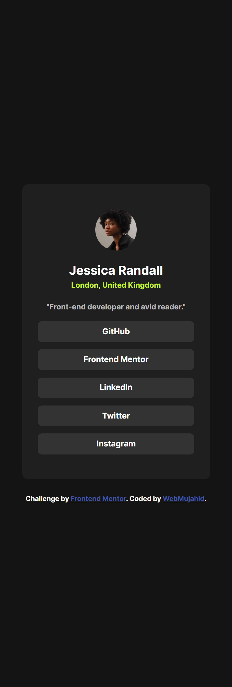

# Frontend Mentor - Social Links Profile Solution  

This is a solution to the [Social Links Profile challenge on Frontend Mentor](https://www.frontendmentor.io/challenges/social-links-profile-UG32l9m6dQ). Frontend Mentor challenges help you improve your coding skills by building realistic projects.

## Table of Contents  

- [Overview](#overview)  
  - [The Challenge](#the-challenge)  
  - [Screenshot](#screenshot)  
  - [Links](#links)  
- [My Process](#my-process)  
  - [Built With](#built-with)  
  - [What I Learned](#what-i-learned)  
  - [Continued Development](#continued-development)  
  - [Useful Resources](#useful-resources)  
- [Author](#author)  
- [Acknowledgments](#acknowledgments)  

## Overview  

### The Challenge  

Users should be able to:  
- View a card displaying a profile picture, name, location, and an about section.  
- Navigate through social media links with hover and focus states.  
- Experience responsive design for various screen sizes.  

### Screenshot  


  

### Links  

- Solution URL: (https://webmujahid-social-links-profile.netlify.app/)  
- Live Site URL: (https://webmujahid-social-links-profile.netlify.app/)  

## My Process  

### Built With  

- Semantic HTML5 markup  
- CSS custom properties  
- Flexbox for layout  
- Mobile-first workflow  
- CSS media queries for responsiveness  

### What I Learned  

This project allowed me to reinforce my understanding of responsive web design and custom CSS properties. One example includes utilizing hover effects to enhance user interaction:  

```css  
.nav-links .link:hover {  
  background-color: var(--Green);  
  color: var(--Grey900);  
  outline: 2px solid var(--Green);  
  outline-offset: 2px;  
}

Additionally, I learned to use @font-face to include custom fonts for better design consistency:

@font-face {  
  font-family: 'Inter';  
  src: url('./assets/fonts/Inter-Regular.ttf') format('truetype');  
  font-weight: 400;  
  font-style: normal;  
}

Continued Development

In future projects, I want to focus on:

Improving ARIA roles and accessibility.

Refining my mobile-first workflow for better responsiveness.

Optimizing images and assets for faster load times.


Useful Resources

CSS Tricks - A Complete Guide to Flexbox - This guide helped with understanding flexbox properties for layout.

MDN Web Docs - A go-to resource for HTML and CSS documentation.


Author

Website - WebMujahid

Frontend Mentor - @Abdulgafar-Riro


Acknowledgments

Thanks to the Frontend Mentor community for inspiring and challenging me to improve my skills!
